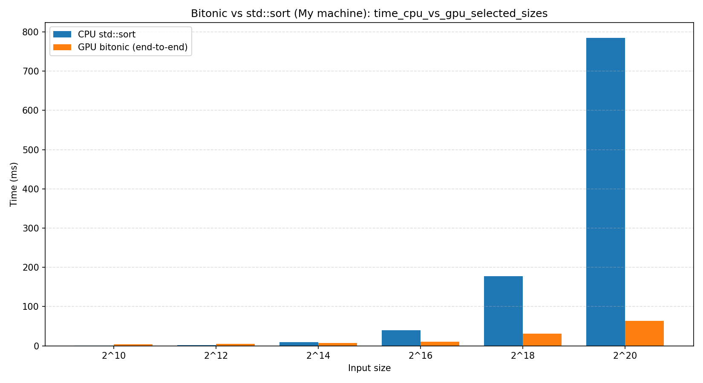
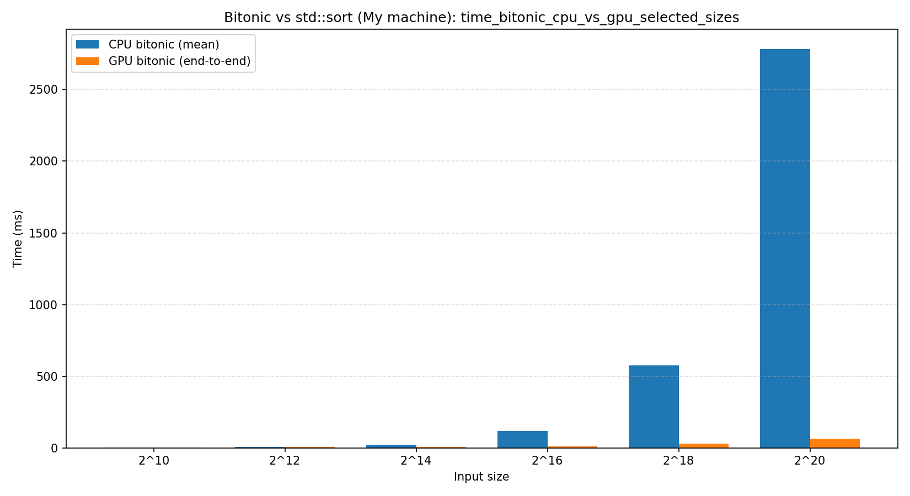

# Bitonic sort

OpenCL-based Bitonic Sort implementation with:
- C++ host code (`CL/opencl.hpp`)
- OpenCL kernel execution on GPU
- deterministic e2e validation
- benchmark and plotting pipeline for:
  - `std::sort` vs bitonic GPU sort
  - bitonic CPU sort vs bitonic GPU sort

## Build

```bash
cmake -S . -B build
cmake --build build
```

## Run CLI sorter

`bitonic_sort_cli` reads integers from `stdin` until EOF and prints sorted output.

```bash
echo "9 -1 4 4 0 -3 7 2 5 1" | ./build/src/apps/bitonic_sort_cli/bitonic_sort_cli
```

## E2E tests

```bash
python3 tests/e2e/run_e2e.py --binary build/src/apps/bitonic_sort_cli/bitonic_sort_cli
```

You can limit e2e cases by the maximum power-of-two exponent:

```bash
python3 tests/e2e/run_e2e.py \
  --binary build/src/apps/bitonic_sort_cli/bitonic_sort_cli \
  --cases-dir tests/e2e/cases \
  --max-exp 20
```

## CI (Linux + Windows)

A CI workflow has been added:
- `.github/workflows/ci.yml`

What it does:
- builds on `ubuntu-latest` and `windows-latest`,
- verifies project configurability and compilability (`cmake` configure + build),
- runs only the smoke runtime test (`opencl_smoke_test`) on both platforms,
- does not run e2e or benchmarks in CI.

## Benchmark & plots

Benchmark workflow documentation:
- [bench/README.md](bench/README.md)

Quick start:

```bash
python3 bench/run_bench.py --binary build/src/apps/bitonic_bench/bitonic_bench
python3 bench/plot_bench.py --summary-csv artifacts/bench/summary.csv --out-dir artifacts/bench/plots
```

## Results on My Machine

Benchmark environment:
- OS: `Ubuntu 24.04.4 LTS`
- CPU: `12th Gen Intel(R) Core(TM) i5-1235U`
- OpenCL platform/device: `Intel(R) OpenCL Graphics` / `Intel(R) Iris(R) Xe Graphics`

Benchmark command:

```bash
python3 bench/run_bench.py \
  --binary build/src/apps/bitonic_bench/bitonic_bench \
  --min-exp 10 --max-exp 20 \
  --seeds 3 --warmup 3 --iters 10
```

Summary table: `std::sort` vs bitonic GPU (mean timings, GPU end-to-end):

| N (2^k) | Size | CPU mean, ms | GPU e2e mean, ms | Speedup (CPU/GPU e2e) |
| --- | ---: | ---: | ---: | ---: |
| 2^10 | 1,024 | 0.412 | 3.494 | 0.118 |
| 2^12 | 4,096 | 2.007 | 4.750 | 0.423 |
| 2^14 | 16,384 | 9.035 | 6.643 | 1.360 |
| 2^16 | 65,536 | 39.794 | 10.364 | 3.840 |
| 2^18 | 262,144 | 177.244 | 30.606 | 5.791 |
| 2^20 | 1,048,576 | 784.746 | 63.534 | 12.352 |

CPU vs GPU time bar chart for sizes `2^10, 2^12, 2^14, 2^16, 2^18, 2^20`:



Summary table: bitonic CPU vs bitonic GPU (mean timings, GPU end-to-end):

| N (2^k) | Size | CPU bitonic mean, ms | GPU e2e mean, ms | Speedup (CPU bitonic/GPU e2e) |
| --- | ---: | ---: | ---: | ---: |
| 2^10 | 1,024 | 0.802 | 3.494 | 0.230 |
| 2^12 | 4,096 | 4.564 | 4.750 | 0.961 |
| 2^14 | 16,384 | 22.732 | 6.643 | 3.422 |
| 2^16 | 65,536 | 116.004 | 10.364 | 11.193 |
| 2^18 | 262,144 | 574.805 | 30.606 | 18.781 |
| 2^20 | 1,048,576 | 2781.800 | 63.534 | 43.784 |

Bitonic CPU vs bitonic GPU time bar chart for sizes `2^10, 2^12, 2^14, 2^16, 2^18, 2^20`:


